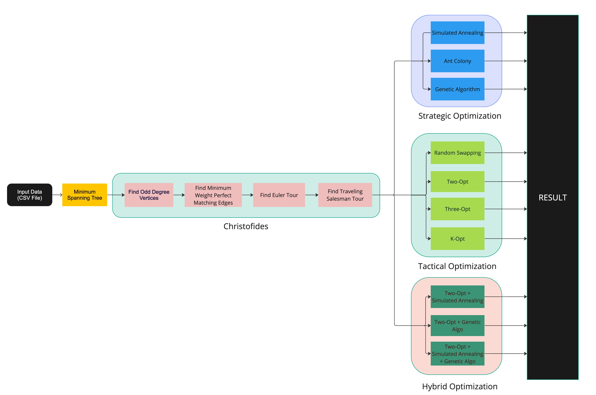
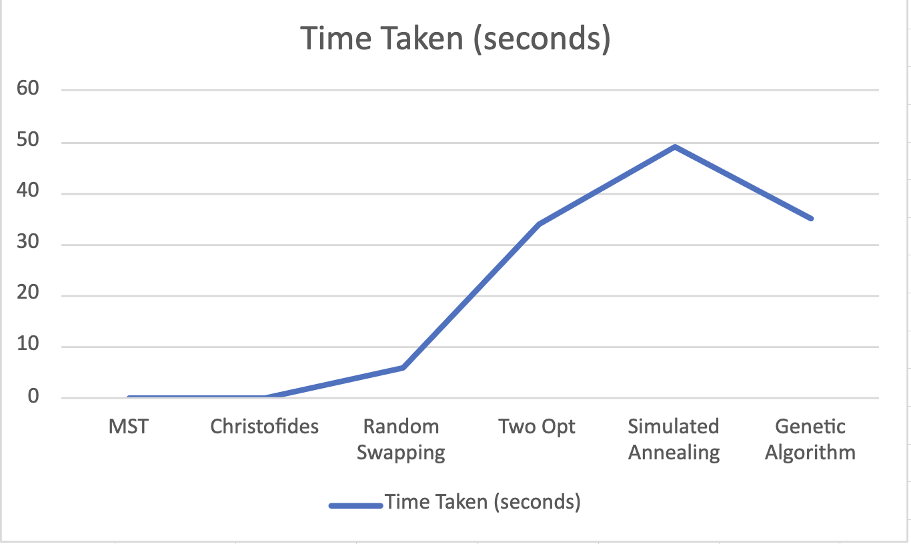
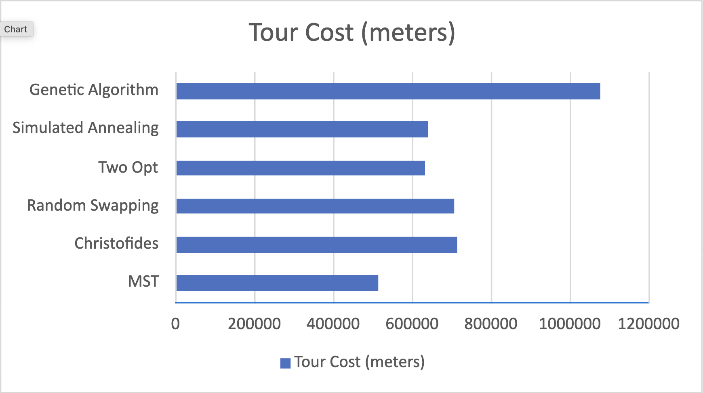

`Aim`
The aim of the Traveling Salesman Problem (TSP) is to find the optimal route for a salesperson to visit a given set of cities and return to the starting city, minimizing the distance travelled.

`How to Run`
Go to [App.java](src/main/java/com/project/App.java) and run.

`Report`
[Report](documentation/INFO%206205%20Spring%202023%20PSA%20Latex_Paper.pdf)

`Flow Diagram`

`Observation`

`Analysis`

`Output Images`

